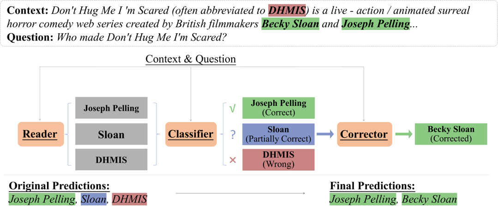

# Correct after Answer: Enhancing Multi-Span Question Answering with Post-Processing Method



## Enviroments

* python : 3.9.13
* CUDA Version : 11.7
* GPU: Tesla V100 32GB

## Install Packages

* run

    ``` bash
    pip install -r requirements.txt
    ```

## Prepare the training data

* We provide the MSQA dataset and our silver-labeled training data for the classifier and the corrector. Unzip the `data.tar.gz` by:

    ``` bash
    tar -zxvf data.tar.gz
    ```

  You are expected to obtain three subfold in `data`:

  ```
    |- data
      |- MultiSpanQA_data   # MSQA dataset
      |- cls_data           # training dataset for the classifier
      |- cor_data           # training dataset for the corrector
  ```

* We also provide the raw script for constructing these datasets in `preprocess`. To construct your own training datasets, following the next steps:

  1. Split original training set into $K$ fold. run:

  ```bash
    cd preprocess
    python split.py \
      --original_file "../data/MultiSpanQA_data/train.json" \
      --split_dir "../data/MSQA_split"
  ```

    Then you will obtain a new directory contain $K$ training and validation subsets.
  
  2. Train a MSQA model with these $K$ training and validation subsets and get the predictions of $K$ validation subsets. Due to the size limitation, we do not provide the implementation of the MSQA model. You can refer to https://github.com/haonan-li/MultiSpanQA.

      We also recommend you to sample N-best predictions with a pointer-model. You can refer to https://github.com/kamalkraj/BERT-SQuAD.

  3. Merge these predictions and get predictions of all the training set with:

  ```bash
    python merge.py \
      --prediction_dir "../predictions/MSQA_predictions" \
      --dst "../data/MSQA_merge_prediction.json"
  ```

  4. Anotate the predictions and get "correct predictions", "partially correct predictions" and "wrong predictions" with:

  ```bash
    python anotate_answer.py \
      --prediction_fp "../data/MSQA_merge_prediction.json" \
      --train_data_fp "../data/MultiSpanQA_data/train.json" \
      --tokenizer_fp "../MODEL/roberta" \ 
      --cls_dst "../predictions/all_answer_cls.json" \
      --cor_dst "../predictions/all_answer_cor.json"
  ```

  5. Construct the training sets and valiation sets for the classifier and the corrector with:

  ```bash
    python preprocess_cls.py \
    --train_data_fp "../data/MultiSpanQA_data/train.json" \
    --answer_fp "../predictions/all_answer_cls.json" \
    --dst_dir "../data/cls_data_new"

    python preprocess_cor.py \
    --train_data_fp "../data/MultiSpanQA_data/train.json" \
    --answer_fp "../predictions/all_answer_cor.json" \
    --dst_dir "../data/cor_data_new"
  ```

## Training the ACC framework

* Before training, we recommend you to download the RoBERTa-base weight from Huggingface (https://huggingface.co/FacebookAI/roberta-base) and move them into `./MODEL/roberta`. If you use the cache weight, you should modify the value of "--model_name_or_path" in the training script.

### Training the classifier

* run the script

  ```bash
    sh train_cls.sh
  ```

* After training, you are excepted to get a new directory `./output_cls` (the output directory "--output_dir" in the script), which consists of:

  ```
    |- output_cls
      |- checkpoint-best    # the best checkpoint on the dev set
      |- predictions        # the raw output on the dev set
      |- dev_results.json   # accuracy on the dev set
  ```

  For the following inference steps, here we recommend you to move the directory `./output_cls/checkpoint-best` to `./MODEL` and rename it, for example, "cls_ckpt".

### Training the corrector

* run the script

  ```bash
    sh train_cor.sh
  ```

* After training, you are excepted to get a new directory `./output_cor`. Move the directory `./output_cor/checkpoint-best` to `./MODEL` and rename it, for example, "cor_ckpt".

## Inference

* Before inference, you should provide a prediction files. We provide a example in `./predictions/prediction_1.json`. You can also put your own prediction files, but make sure the format is the same as `./predictions/prediction_1.json`.

* To do inference, run script:

  ```
    sh run_acc.sh
  ```

  The results are in `./output_acc/result.csv`, and the final outputs of the ACC framework are in `./output_acc/predictions_cor.json`

## 20240921 Update

* This paper has been accepted as EMNLP 2024 Findings recently.
* We update the image we use in README. Old image is renamed as `ACC-legacy.png` in the fold `image`.

## 20241028 Update

* We have placed the preprint paper on arXiv (https://arxiv.org/pdf/2410.16788), and we also add the PDF file `ACC.pdf` to this repository.
* We update the image again, which is now consistent to that used in the paper.
